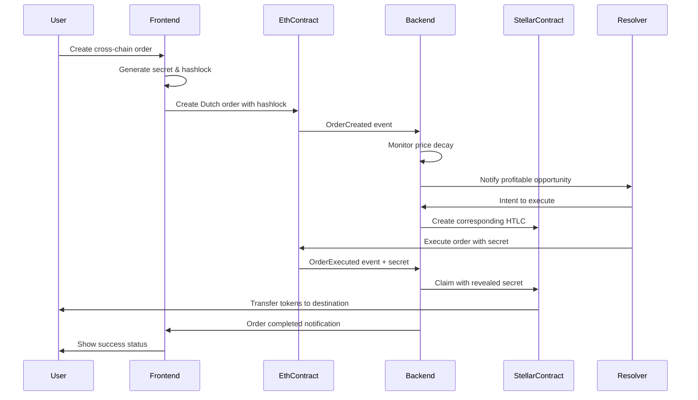

# 1inch Fusion+ Extension to Stellar: Complete Implementation Plan

## Executive Summary

This document outlines the complete implementation plan for extending 1inch Fusion+ capabilities to Stellar Network, creating a cross-chain Dutch auction-based order execution system. The implementation combines Ethereum HTLC contracts, Stellar Soroban smart contracts, a resolver network backend, and a unified frontend interface.

## Table of Contents

1. [Architecture Overview](#architecture-overview)
2. [Smart Contract Implementation](#smart-contract-implementation)
3. [Resolver Backend Service](#resolver-backend-service)
4. [Frontend Implementation](#frontend-implementation)
5. [Cross-Chain Flow](#cross-chain-flow)
6. [Security Considerations](#security-considerations)
7. [Implementation Timeline](#implementation-timeline)
8. [Technical Requirements](#technical-requirements)

---

## Architecture Overview

### Core Components

```
┌─────────────────┐    ┌─────────────────┐    ┌─────────────────┐
│   Frontend UI   │    │  Resolver       │    │  Order Book     │
│                 │    │  Backend        │    │  Service        │
│ - Wallet Mgmt   │    │                 │    │                 │
│ - Order Creation│◄──►│ - Event Monitor │◄──►│ - Order Storage │
│ - Status Monitor│    │ - HTLC Manager  │    │ - Price Oracle  │
└─────────────────┘    │ - Secret Relay  │    │ - Matching      │
         │              └─────────────────┘    └─────────────────┘
         │                       │                       │
    ┌────▼────┐             ┌────▼────┐             ┌────▼────┐
    │Ethereum │             │ Stellar │             │Database │
    │  HTLC   │◄───────────►│  HTLC   │             │ & Cache │
    │Contract │             │Contract │             │         │
    └─────────┘             └─────────┘             └─────────┘
```

### Key Innovations

1. **Dutch Auction HTLC**: Combines time-based price decay with atomic swaps
2. **Cross-Chain Resolver Network**: Professional market makers on both chains
3. **Unified Order Book**: Single interface for cross-chain liquidity
4. **MEV Protection**: Time-locked orders prevent front-running
5. **Gasless Experience**: Resolvers pay gas fees for better UX

---

## Smart Contract Implementation

### 1. Ethereum Fusion+ HTLC Contract

#### Enhanced Features Beyond Basic HTLC

```solidity
// SPDX-License-Identifier: MIT
pragma solidity ^0.8.19;

import "@openzeppelin/contracts/token/ERC20/IERC20.sol";
import "@openzeppelin/contracts/security/ReentrancyGuard.sol";
import "@openzeppelin/contracts/access/Ownable.sol";

contract FusionPlusHTLC is ReentrancyGuard, Ownable {
    struct DutchOrder {
        address maker;           // Order creator
        address taker;           // Optional specific taker
        IERC20 tokenIn;         // Input token
        IERC20 tokenOut;        // Output token
        uint256 amountIn;       // Input amount
        uint256 startAmountOut; // Starting output amount (higher)
        uint256 endAmountOut;   // Ending output amount (lower)
        uint256 startTime;      // Auction start time
        uint256 endTime;        // Auction end time
        uint256 deadline;       // Hard deadline
        bytes32 hashlock;       // Secret hash
        uint256 chainId;        // Destination chain
        bytes32 stellarAccount; // Stellar destination
        bool executed;          // Execution status
        bool refunded;          // Refund status
    }

    mapping(bytes32 => DutchOrder) public orders;
    mapping(address => uint256) public resolverBonds;

    uint256 public constant MIN_BOND = 1 ether;
    uint256 public constant AUCTION_DURATION = 600; // 10 minutes

    event OrderCreated(
        bytes32 indexed orderId,
        address indexed maker,
        uint256 amountIn,
        uint256 startAmountOut,
        uint256 endAmountOut
    );

    event OrderExecuted(
        bytes32 indexed orderId,
        address indexed resolver,
        uint256 amountOut,
        bytes32 preimage
    );

    // Dutch auction price calculation
    function getCurrentPrice(bytes32 orderId)
        public view returns (uint256) {
        DutchOrder memory order = orders[orderId];
        if (block.timestamp <= order.startTime) {
            return order.startAmountOut;
        }
        if (block.timestamp >= order.endTime) {
            return order.endAmountOut;
        }

        uint256 elapsed = block.timestamp - order.startTime;
        uint256 duration = order.endTime - order.startTime;
        uint256 decay = (order.startAmountOut - order.endAmountOut) * elapsed / duration;

        return order.startAmountOut - decay;
    }

    // Create fusion+ order with Dutch auction
    function createOrder(
        IERC20 tokenIn,
        IERC20 tokenOut,
        uint256 amountIn,
        uint256 startAmountOut,
        uint256 endAmountOut,
        uint256 deadline,
        bytes32 hashlock,
        uint256 chainId,
        bytes32 stellarAccount
    ) external returns (bytes32 orderId) {
        require(startAmountOut > endAmountOut, "Invalid price range");
        require(deadline > block.timestamp + AUCTION_DURATION, "Insufficient time");

        orderId = keccak256(abi.encodePacked(
            msg.sender, tokenIn, tokenOut, amountIn, hashlock, block.timestamp
        ));

        orders[orderId] = DutchOrder({
            maker: msg.sender,
            taker: address(0),
            tokenIn: tokenIn,
            tokenOut: tokenOut,
            amountIn: amountIn,
            startAmountOut: startAmountOut,
            endAmountOut: endAmountOut,
            startTime: block.timestamp,
            endTime: block.timestamp + AUCTION_DURATION,
            deadline: deadline,
            hashlock: hashlock,
            chainId: chainId,
            stellarAccount: stellarAccount,
            executed: false,
            refunded: false
        });

        tokenIn.transferFrom(msg.sender, address(this), amountIn);

        emit OrderCreated(orderId, msg.sender, amountIn, startAmountOut, endAmountOut);
        return orderId;
    }

    // Execute order (called by resolver)
    function executeOrder(
        bytes32 orderId,
        bytes32 preimage
    ) external nonReentrant {
        DutchOrder storage order = orders[orderId];
        require(!order.executed && !order.refunded, "Order completed");
        require(block.timestamp <= order.deadline, "Order expired");
        require(sha256(abi.encodePacked(preimage)) == order.hashlock, "Invalid preimage");
        require(resolverBonds[msg.sender] >= MIN_BOND, "Insufficient bond");

        uint256 currentPrice = getCurrentPrice(orderId);

        order.executed = true;
        order.taker = msg.sender;

        // Transfer tokens to resolver
        order.tokenIn.transfer(msg.sender, order.amountIn);

        emit OrderExecuted(orderId, msg.sender, currentPrice, preimage);
    }
}
```

### 2. Stellar Soroban Fusion+ Contract

#### Enhanced Soroban Implementation

```rust
#![no_std]
use soroban_sdk::{
    contract, contractimpl, contracttype, symbol_short, token,
    Address, Bytes, BytesN, Env, Map, Symbol, Vec, log
};

#[derive(Clone)]
#[contracttype]
pub struct DutchOrder {
    pub maker: Address,
    pub taker: Option<Address>,
    pub token_in: Address,
    pub token_out: Address,
    pub amount_in: i128,
    pub start_amount_out: i128,
    pub end_amount_out: i128,
    pub start_time: u64,
    pub end_time: u64,
    pub deadline: u64,
    pub hashlock: BytesN<32>,
    pub eth_account: Bytes,
    pub executed: bool,
    pub refunded: bool,
}

#[derive(Clone)]
#[contracttype]
pub enum DataKey {
    Order(BytesN<32>),
    ResolverBond(Address),
    Admin,
}

#[contract]
pub struct FusionPlusStellar;

#[contractimpl]
impl FusionPlusStellar {

    pub fn create_order(
        env: Env,
        maker: Address,
        token_in: Address,
        token_out: Address,
        amount_in: i128,
        start_amount_out: i128,
        end_amount_out: i128,
        deadline: u64,
        hashlock: BytesN<32>,
        eth_account: Bytes,
    ) -> BytesN<32> {
        maker.require_auth();

        let current_time = env.ledger().timestamp();
        let auction_duration = 600; // 10 minutes

        assert!(start_amount_out > end_amount_out, "Invalid price range");
        assert!(deadline > current_time + auction_duration, "Insufficient time");

        let order_id = env.crypto().sha256(&[
            maker.clone().into(),
            token_in.clone().into(),
            token_out.clone().into(),
            amount_in.into(),
            hashlock.clone().into(),
            current_time.into(),
        ].concat());

        let order = DutchOrder {
            maker: maker.clone(),
            taker: None,
            token_in: token_in.clone(),
            token_out,
            amount_in,
            start_amount_out,
            end_amount_out,
            start_time: current_time,
            end_time: current_time + auction_duration,
            deadline,
            hashlock,
            eth_account,
            executed: false,
            refunded: false,
        };

        env.storage().persistent().set(&DataKey::Order(order_id), &order);

        // Lock tokens
        let token_client = token::Client::new(&env, &token_in);
        token_client.transfer(&maker, &env.current_contract_address(), &amount_in);

        log!(
            &env,
            "Order created: {} by {} for {} tokens",
            order_id,
            maker,
            amount_in
        );

        order_id
    }

    pub fn get_current_price(env: Env, order_id: BytesN<32>) -> i128 {
        let order: DutchOrder = env.storage().persistent()
            .get(&DataKey::Order(order_id))
            .unwrap();

        let current_time = env.ledger().timestamp();

        if current_time <= order.start_time {
            return order.start_amount_out;
        }
        if current_time >= order.end_time {
            return order.end_amount_out;
        }

        let elapsed = current_time - order.start_time;
        let duration = order.end_time - order.start_time;
        let decay = (order.start_amount_out - order.end_amount_out) * elapsed as i128 / duration as i128;

        order.start_amount_out - decay
    }

    pub fn execute_order(
        env: Env,
        resolver: Address,
        order_id: BytesN<32>,
        preimage: Bytes,
    ) -> bool {
        resolver.require_auth();

        let mut order: DutchOrder = env.storage().persistent()
            .get(&DataKey::Order(order_id))
            .unwrap();

        assert!(!order.executed && !order.refunded, "Order completed");
        assert!(env.ledger().timestamp() <= order.deadline, "Order expired");

        // Verify preimage
        let computed_hash = env.crypto().sha256(&preimage);
        assert!(computed_hash == order.hashlock, "Invalid preimage");

        // Check resolver bond
        let min_bond = 10_000_000i128; // 10 XLM
        let bond: i128 = env.storage().persistent()
            .get(&DataKey::ResolverBond(resolver.clone()))
            .unwrap_or(0);
        assert!(bond >= min_bond, "Insufficient bond");

        let current_price = Self::get_current_price(env.clone(), order_id);

        order.executed = true;
        order.taker = Some(resolver.clone());

        env.storage().persistent().set(&DataKey::Order(order_id), &order);

        // Transfer tokens to resolver
        let token_client = token::Client::new(&env, &order.token_in);
        token_client.transfer(
            &env.current_contract_address(),
            &resolver,
            &order.amount_in
        );

        log!(
            &env,
            "Order executed: {} by {} at price {}",
            order_id,
            resolver,
            current_price
        );

        true
    }
}
```

---

## Resolver Backend Service

### Core Architecture

```typescript
// Backend Service Structure
interface ResolverService {
  orderMonitor: OrderMonitor;
  priceCalculator: PriceCalculator;
  riskManager: RiskManager;
  executionEngine: ExecutionEngine;
  crossChainBridge: CrossChainBridge;
}

// Order monitoring and execution logic
class FusionPlusResolver {
  private ethereumProvider: ethers.Provider;
  private stellarServer: StellarSdk.Server;
  private orderBook: Map<string, Order>;

  constructor() {
    this.ethereumProvider = new ethers.JsonRpcProvider(ETH_RPC_URL);
    this.stellarServer = new StellarSdk.Server(STELLAR_RPC_URL);
    this.orderBook = new Map();
  }

  // Monitor Dutch auction orders across chains
  async monitorOrders() {
    // Listen to Ethereum events
    const ethContract = new ethers.Contract(
      ETH_CONTRACT_ADDRESS,
      ETH_ABI,
      this.ethereumProvider
    );

    ethContract.on("OrderCreated", async (orderId, maker, ...args) => {
      const order = await this.parseEthereumOrder(orderId, args);
      await this.evaluateOrder(order);
    });

    // Listen to Stellar events
    this.stellarServer
      .effects()
      .cursor("now")
      .stream({
        onmessage: (effect) => this.handleStellarEffect(effect),
      });
  }

  // Evaluate order profitability in real-time
  async evaluateOrder(order: Order): Promise<boolean> {
    const currentPrice = this.calculateCurrentPrice(order);
    const marketPrice = await this.getMarketPrice(
      order.tokenIn,
      order.tokenOut
    );
    const gasCost = await this.estimateGasCost(order);

    const profit = currentPrice - marketPrice - gasCost;
    const profitMargin = profit / marketPrice;

    // Execute if profitable
    if (profitMargin > this.minProfitMargin) {
      return await this.executeOrder(order);
    }

    return false;
  }

  // Cross-chain order execution
  async executeOrder(order: Order): Promise<boolean> {
    try {
      // Generate secret for HTLC
      const secret = crypto.randomBytes(32);
      const hashlock = crypto.createHash("sha256").update(secret).digest();

      if (order.chainId === 1) {
        // Ethereum order
        // Execute on Ethereum, prepare Stellar
        const ethTx = await this.executeEthereumOrder(order.id, secret);
        const stellarTx = await this.prepareStellarHTLC(order, hashlock);

        // Monitor and complete cross-chain
        await this.monitorCrossChainExecution(ethTx, stellarTx, secret);
      } else {
        // Stellar order
        // Execute on Stellar, prepare Ethereum
        const stellarTx = await this.executeStellarOrder(order.id, secret);
        const ethTx = await this.prepareEthereumHTLC(order, hashlock);

        await this.monitorCrossChainExecution(stellarTx, ethTx, secret);
      }

      return true;
    } catch (error) {
      console.error("Order execution failed:", error);
      return false;
    }
  }

  // Dutch auction price calculation
  calculateCurrentPrice(order: Order): number {
    const now = Date.now() / 1000;

    if (now <= order.startTime) return order.startAmountOut;
    if (now >= order.endTime) return order.endAmountOut;

    const elapsed = now - order.startTime;
    const duration = order.endTime - order.startTime;
    const decay =
      ((order.startAmountOut - order.endAmountOut) * elapsed) / duration;

    return order.startAmountOut - decay;
  }
}
```

### Risk Management System

```typescript
class RiskManager {
  private maxOrderSize = 100000; // USD
  private maxDailyVolume = 1000000; // USD
  private currentDailyVolume = 0;

  async assessRisk(order: Order): Promise<RiskAssessment> {
    return {
      sizeRisk: this.assessSizeRisk(order),
      liquidityRisk: await this.assessLiquidityRisk(order),
      counterpartyRisk: await this.assessCounterpartyRisk(order.maker),
      technicalRisk: this.assessTechnicalRisk(order),
      recommendation: "EXECUTE" | "SKIP" | "MONITOR",
    };
  }

  private assessLiquidityRisk(order: Order): Promise<number> {
    // Check DEX liquidity on both chains
    // Return risk score 0-1
  }

  private assessCounterpartyRisk(maker: string): Promise<number> {
    // Check maker's history, reputation
    // Return risk score 0-1
  }
}
```

---

## Frontend Implementation

### Multi-Chain Wallet Integration

```typescript
// Wallet management for both Ethereum and Stellar
class MultiChainWallet {
  private ethWallet: EthereumWallet;
  private stellarWallet: StellarWallet;

  async connectWallets() {
    // Ethereum connection
    if (window.ethereum) {
      this.ethWallet = new EthereumWallet(window.ethereum);
      await this.ethWallet.connect();
    }

    // Stellar connection (Freighter, Albedo, etc.)
    if (window.freighter) {
      this.stellarWallet = new StellarWallet(window.freighter);
      await this.stellarWallet.connect();
    }
  }

  async getBalances(): Promise<Balance[]> {
    const [ethBalances, stellarBalances] = await Promise.all([
      this.ethWallet.getBalances(),
      this.stellarWallet.getBalances(),
    ]);

    return [...ethBalances, ...stellarBalances];
  }
}

// Order creation interface
class OrderCreationUI {
  async createFusionOrder(params: OrderParams): Promise<string> {
    const {
      fromToken,
      toToken,
      amount,
      slippage,
      deadline,
      fromChain,
      toChain,
    } = params;

    // Calculate Dutch auction parameters
    const marketPrice = await this.getMarketPrice(fromToken, toToken);
    const startPrice = marketPrice * (1 + slippage);
    const endPrice = marketPrice * (1 - slippage);

    // Generate hashlock
    const secret = crypto.randomBytes(32);
    const hashlock = await crypto.subtle.digest("SHA-256", secret);

    // Create order on source chain
    let tx;
    if (fromChain === "ethereum") {
      tx = await this.createEthereumOrder({
        ...params,
        startPrice,
        endPrice,
        hashlock: Array.from(new Uint8Array(hashlock)),
      });
    } else {
      tx = await this.createStellarOrder({
        ...params,
        startPrice,
        endPrice,
        hashlock: Array.from(new Uint8Array(hashlock)),
      });
    }

    // Store secret securely
    await this.storeSecret(tx.orderId, secret);

    return tx.orderId;
  }
}
```

### Real-Time Order Monitoring

```typescript
// Order status tracking
class OrderMonitorUI {
  private socket: WebSocket;
  private orders: Map<string, OrderStatus> = new Map();

  constructor() {
    this.socket = new WebSocket(WS_ENDPOINT);
    this.setupEventListeners();
  }

  setupEventListeners() {
    this.socket.onmessage = (event) => {
      const update: OrderUpdate = JSON.parse(event.data);
      this.handleOrderUpdate(update);
    };
  }

  handleOrderUpdate(update: OrderUpdate) {
    const { orderId, status, currentPrice, resolver } = update;

    this.orders.set(orderId, {
      ...this.orders.get(orderId),
      status,
      currentPrice,
      resolver,
      lastUpdate: Date.now(),
    });

    // Update UI
    this.renderOrderStatus(orderId);

    // Show notifications
    if (status === "EXECUTED") {
      this.showNotification(
        `Order ${orderId.slice(0, 8)}... executed at ${currentPrice}`
      );
    }
  }

  renderOrderStatus(orderId: string) {
    const order = this.orders.get(orderId);
    const element = document.getElementById(`order-${orderId}`);

    if (element && order) {
      element.innerHTML = `
        <div class="order-card">
          <div class="order-header">
            <span class="order-id">${orderId.slice(0, 8)}...</span>
            <span class="order-status ${order.status.toLowerCase()}">${
        order.status
      }</span>
          </div>
          <div class="order-details">
            <div class="price-info">
              <span>Current Price: ${order.currentPrice}</span>
              <div class="price-chart">${this.renderPriceChart(order)}</div>
            </div>
            <div class="progress-bar">
              <div class="progress" style="width: ${this.calculateProgress(
                order
              )}%"></div>
            </div>
          </div>
        </div>
      `;
    }
  }
}
```

---

## Cross-Chain Flow

### Complete User Journey



### Error Handling and Recovery

```typescript
class CrossChainRecovery {
  async handleFailedOrder(orderId: string, error: OrderError) {
    switch (error.type) {
      case "TIMEOUT":
        await this.initiateRefund(orderId);
        break;
      case "INSUFFICIENT_LIQUIDITY":
        await this.adjustPricing(orderId);
        break;
      case "CHAIN_CONGESTION":
        await this.increaseGasPrice(orderId);
        break;
      case "RESOLVER_FAILURE":
        await this.reassignOrder(orderId);
        break;
    }
  }

  async initiateRefund(orderId: string) {
    const order = await this.getOrder(orderId);

    if (order.sourceChain === "ethereum") {
      await this.refundEthereumOrder(orderId);
    } else {
      await this.refundStellarOrder(orderId);
    }
  }
}
```

---

## Security Considerations

### Smart Contract Security

1. **Reentrancy Protection**: Use OpenZeppelin's ReentrancyGuard
2. **Access Controls**: Proper role-based permissions
3. **Input Validation**: Comprehensive parameter checking
4. **Audit Requirements**: Professional security audit before mainnet

### Backend Security

1. **Key Management**: Hardware wallets or secure enclaves
2. **API Security**: Rate limiting, authentication, HTTPS
3. **Database Security**: Encrypted storage, access logs
4. **Monitoring**: Real-time alerting for anomalies

### Cross-Chain Security

1. **Secret Management**: Secure generation and storage
2. **Timelock Coordination**: Proper sequencing between chains
3. **MEV Protection**: Dutch auction prevents front-running
4. **Resolver Bonding**: Economic security through staking

---

## Implementation Timeline

### Phase 1: Core Infrastructure (Weeks 1-4)

- [ ] Ethereum HTLC contract development
- [ ] Stellar Soroban contract development
- [ ] Basic backend event monitoring
- [ ] Simple frontend wallet integration

### Phase 2: Dutch Auction Logic (Weeks 5-8)

- [ ] Price decay mechanisms
- [ ] Resolver evaluation logic
- [ ] Cross-chain coordination
- [ ] Order book management

### Phase 3: Advanced Features (Weeks 9-12)

- [ ] Risk management system
- [ ] Advanced UI/UX
- [ ] Performance optimization
- [ ] Security audits

### Phase 4: Production Deployment (Weeks 13-16)

- [ ] Mainnet deployment
- [ ] Resolver onboarding
- [ ] User testing
- [ ] Marketing and launch

---

## Technical Requirements

### Infrastructure

- **Ethereum**: Sepolia testnet → Mainnet
- **Stellar**: Testnet → Mainnet
- **Backend**: Node.js/TypeScript, PostgreSQL, Redis
- **Frontend**: React, Web3.js, Stellar SDK
- **Monitoring**: Grafana, Prometheus

### Development Tools

- **Ethereum**: Hardhat, OpenZeppelin, Ethers.js
- **Stellar**: Soroban CLI, Stellar SDK, Freighter
- **Testing**: Jest, Mocha, Foundry
- **CI/CD**: GitHub Actions, Docker

### Performance Targets

- **Order Execution**: < 30 seconds average
- **Price Updates**: < 5 seconds
- **UI Response**: < 2 seconds
- **Uptime**: 99.9% availability

This comprehensive implementation plan provides the foundation for building a production-ready cross-chain Fusion+ system extending 1inch's innovations to the Stellar ecosystem.
