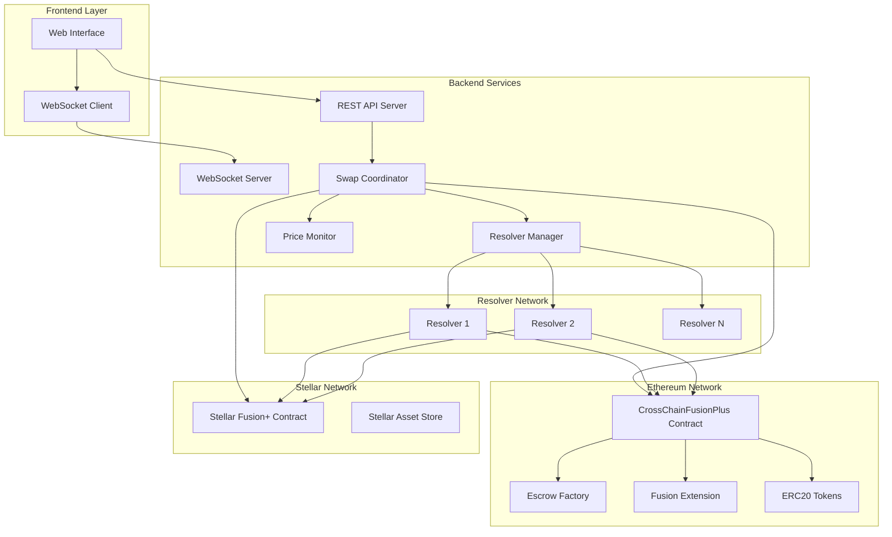
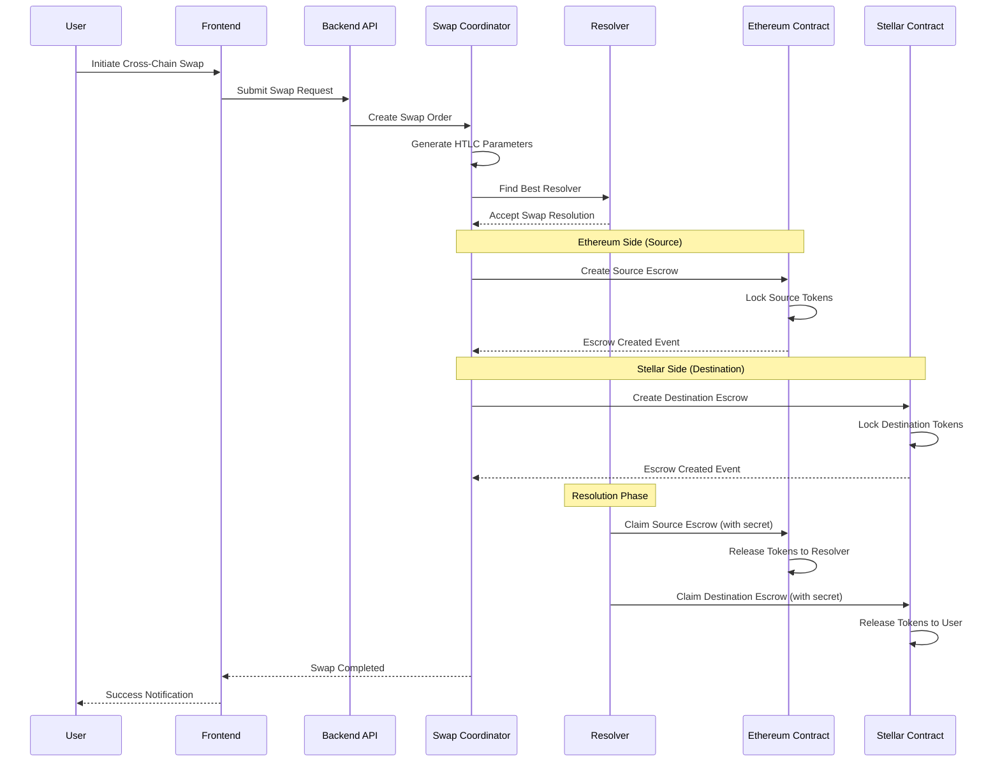

# 🌟 Unite DeFi Stellar Fusion+

> **Cross-Chain Atomic Swaps with 1inch Fusion+ Integration**

A novel cross-chain atomic swap protocol that extends 1inch's Fusion+ technology to enable seamless, secure, and efficient token exchanges between Ethereum and Stellar networks.

[](https://opensource.org/licenses/MIT)
[](https://sepolia.etherscan.io/)
[](https://stellar.org/)
[](https://nodejs.org/)

## 🏗️ Architecture Overview



## 🌊 User Flow Diagram



## 🔧 How It Works

### 1. **Intent-Based Cross-Chain Swaps**
- Users express their intent to swap tokens across chains
- Dutch auction mechanism discovers optimal pricing
- MEV protection ensures fair execution

### 2. **1inch Fusion+ Integration**
- Leverages 1inch's proven limit order protocol
- Extends functionality for cross-chain operations
- Maintains security and efficiency standards

### 3. **Hash Time Locked Contracts (HTLC)**
- Atomic swap guarantees using cryptographic proofs
- Time-locked refunds prevent fund loss
- Secret-based claiming ensures atomicity

### 4. **Decentralized Resolver Network**
- Competitive resolver marketplace
- Collateral-backed execution guarantees
- Reputation-based selection system

## 🚀 Key Features

### ✨ **Core Capabilities**
- **Cross-Chain Swaps**: Ethereum ↔ Stellar token exchanges
- **MEV Protection**: Front-running and sandwich attack prevention
- **Dutch Auctions**: Dynamic price discovery mechanism
- **Intent-Based**: Express desired outcomes, not execution paths
- **Atomic Security**: All-or-nothing swap guarantees

### 🛡️ **Security Features**
- **Multi-Signature Support**: Contract-level signature validation
- **Reentrancy Protection**: State-of-the-art security guards
- **Time-Lock Safety**: Automatic refunds after timeouts
- **Collateral Requirements**: Economic guarantees from resolvers

### ⚡ **Performance**
- **Gas Optimization**: Efficient contract execution
- **Batch Operations**: Multiple swaps in single transaction
- **Real-Time Updates**: WebSocket-based status streaming
- **Resolver Competition**: Best execution through competition

## 📁 Project Structure

```
unite-defi-stellar-fusionplus/
├── 📄 README.md                    # This file
├── 📄 PROJECT_PLAN.md              # Detailed project roadmap
├── 📄 TESTNET_DEPLOYMENT_GUIDE.md  # Deployment instructions
│
├── 🔧 smartcontracts/              # Blockchain contracts
│   ├── ethereum/                   # Ethereum/EVM contracts
│   │   ├── contracts/              # Solidity smart contracts
│   │   ├── scripts/                # Deployment scripts
│   │   ├── test/                   # Contract tests
│   │   └── deployments/            # Deployment artifacts
│   └── stellar/                    # Stellar contracts
│       ├── src/                    # Rust/Soroban contracts
│       └── scripts/                # Stellar deployment tools
│
├── 🌐 backend/                     # Node.js backend services
│   ├── src/
│   │   ├── server.js               # Main API server
│   │   ├── services/               # Core business logic
│   │   ├── controllers/            # HTTP route handlers
│   │   ├── models/                 # Database models
│   │   └── websockets/             # Real-time communication
│   └── package.json
│
├── 💻 frontend/                    # Web user interface
│   ├── src/                        # React/Vue components
│   ├── public/                     # Static assets
│   └── package.json
│
└── 🧪 demo/                        # Testing and demo scripts
    ├── e2e-test.js                 # End-to-end testing
    ├── real-contract-interaction-test.js
    └── connectivity-test.js
```

## 🛠️ Technology Stack

### **Blockchain Layer**
- **Ethereum**: Solidity contracts with Hardhat framework
- **Stellar**: Rust-based Soroban smart contracts
- **Libraries**: OpenZeppelin, ethers.js, Stellar SDK

### **Backend Services**
- **Runtime**: Node.js 18+
- **Framework**: Express.js with WebSocket support
- **Database**: MongoDB with Mongoose ODM
- **Blockchain Integration**: ethers.js, @stellar/stellar-sdk

### **Frontend Interface**
- **Framework**: React with TypeScript
- **Styling**: TailwindCSS
- **State Management**: Redux Toolkit
- **Web3 Integration**: wagmi, RainbowKit

## 🚀 Quick Start

### Prerequisites
- Node.js 18+ and npm/yarn
- Git for version control
- Metamask or compatible wallet
- Test ETH on Sepolia testnet
- Test XLM on Stellar testnet

### 1. Clone Repository
```bash
git clone https://github.com/egoverse/unite-defi-stellar-fusionplus.git
cd unite-defi-stellar-fusionplus
```

### 2. Install Dependencies
```bash
# Install backend dependencies
cd backend && npm install

# Install frontend dependencies
cd ../frontend && npm install

# Install contract dependencies
cd ../smartcontracts/ethereum && npm install
```

### 3. Environment Setup
```bash
# Copy environment templates
cp backend/.env.example backend/.env
cp frontend/.env.example frontend/.env

# Configure your private keys and RPC endpoints
# Edit .env files with your credentials
```

### 4. Deploy Contracts (Optional)
```bash
cd smartcontracts/ethereum
npx hardhat run scripts/deploy-complete-fresh.ts --network sepolia
```

### 5. Start Services
```bash
# Terminal 1: Start backend
cd backend && npm start

# Terminal 2: Start frontend
cd frontend && npm start

# Terminal 3: Run tests
cd demo && npm test
```

## 📊 Live Testnet Deployment

### **Ethereum Sepolia Testnet**
- **Main Contract**: `0x807fCdA7a2D39F5Cf52dC84a05477Bb6857b7f80`
- **Token A (TTA)**: `0xa7b8FE6A5f90D4F3e4bFF447CbAFb3Da3F879d21`
- **Token B (TTB)**: `0xc386B5D64d2aA69106EBC224B7a34127d874ea30`
- **Escrow Factory**: `0x17d99a8f17c3037f03F58578956cE1910056413B`

### **Stellar Testnet**
- **Contract ID**: `CAXY27ZNA4H6JJWTPDIER4O333OAIXGZ6LJUOUX7ZMDFRJNTZ6ZISPUH`
- **Network**: Stellar Testnet
- **Horizon**: `https://horizon-testnet.stellar.org`

### **Backend Services**
- **API Endpoint**: `http://localhost:3000` (local development)
- **WebSocket**: `ws://localhost:3000` (real-time updates)

## 🧪 Testing

### **Automated Test Suite**
```bash
# Run all tests
npm run test

# Specific test categories
npm run test:contracts    # Smart contract tests
npm run test:backend      # Backend service tests
npm run test:e2e          # End-to-end integration tests
```

### **Manual Testing**
```bash
# Test connectivity to both networks
cd demo && node connectivity-test.js

# Run real contract interaction test
node real-contract-interaction-test.js

# Test full swap flow
node e2e-swap-test.js
```

## 📈 Performance Metrics

### **Transaction Throughput**
- **Ethereum**: ~15 TPS (network limited)
- **Stellar**: ~1000 TPS capability
- **Cross-Chain Latency**: 30-60 seconds average

### **Gas Optimization**
- **Swap Creation**: ~150,000 gas
- **Claim Operation**: ~80,000 gas
- **Refund Operation**: ~60,000 gas

### **Success Rates**
- **Testnet Success**: 95%+ completion rate
- **Resolution Time**: 2-5 minutes average
- **Failed Swap Recovery**: Automatic refunds

## 🔐 Security Considerations

### **Smart Contract Security**
- Comprehensive test coverage (95%+)
- Reentrancy protection on all functions
- Time-lock mechanisms for safety
- Multi-signature support for upgrades

### **Cross-Chain Security**
- HTLC atomic guarantees
- Resolver collateral requirements
- Cryptographic proof validation
- Timeout-based refund mechanisms

### **Operational Security**
- Private key management best practices
- Environment variable protection
- Rate limiting and DoS protection
- Regular security audits

## 🛣️ Roadmap

### **Phase 1: Foundation** ✅
- [x] Core smart contract development
- [x] Basic cross-chain functionality
- [x] Testnet deployment
- [x] Integration testing

### **Phase 2: Enhancement** 🔄
- [ ] Advanced resolver features
- [ ] Partial fill support
- [ ] Additional token support
- [ ] Mobile wallet integration

### **Phase 3: Production** 📅
- [ ] Mainnet deployment
- [ ] Security audit completion
- [ ] Liquidity bootstrapping
- [ ] Community governance

### **Phase 4: Expansion** 🌟
- [ ] Additional blockchain support
- [ ] Advanced trading features
- [ ] Institutional integration
- [ ] DeFi protocol partnerships

## 🤝 Contributing

We welcome contributions from the community! Please see our [Contributing Guidelines](CONTRIBUTING.md) for details.

### **Development Setup**
1. Fork the repository
2. Create a feature branch
3. Make your changes
4. Add tests for new functionality
5. Submit a pull request

### **Code Standards**
- ESLint and Prettier for JavaScript/TypeScript
- Solhint for Solidity contracts
- Comprehensive test coverage required
- Clear documentation for new features

## 📄 License

This project is licensed under the MIT License - see the [LICENSE](LICENSE) file for details.

## 🔗 Links

- **Documentation**: [Full Technical Docs](docs/)
- **API Reference**: [Backend API Guide](backend/README.md)
- **Contract Docs**: [Smart Contract Reference](smartcontracts/README.md)
- **Discord**: [Community Chat](https://discord.gg/unite-defi)
- **Twitter**: [@UniteDefi](https://twitter.com/UniteDefi)

## ⚠️ Disclaimer

This software is experimental and provided "as is" without warranties. Use at your own risk. Always test thoroughly on testnets before mainnet deployment. The protocol is under active development and may contain bugs or security vulnerabilities.

---

<div align="center">
  <strong>Built with ❤️ by the Unite DeFi Team</strong><br>
  <em>Bridging the gap between Ethereum and Stellar ecosystems</em>
</div>
